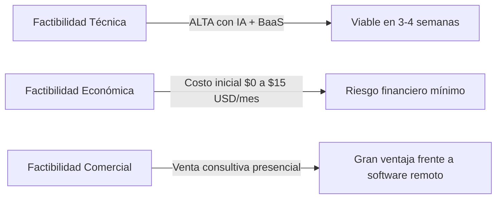
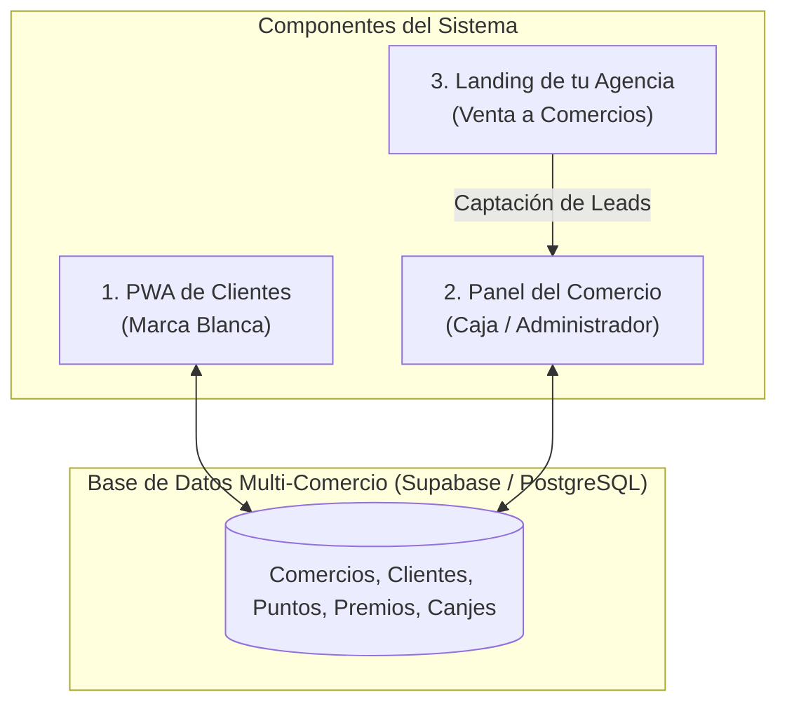
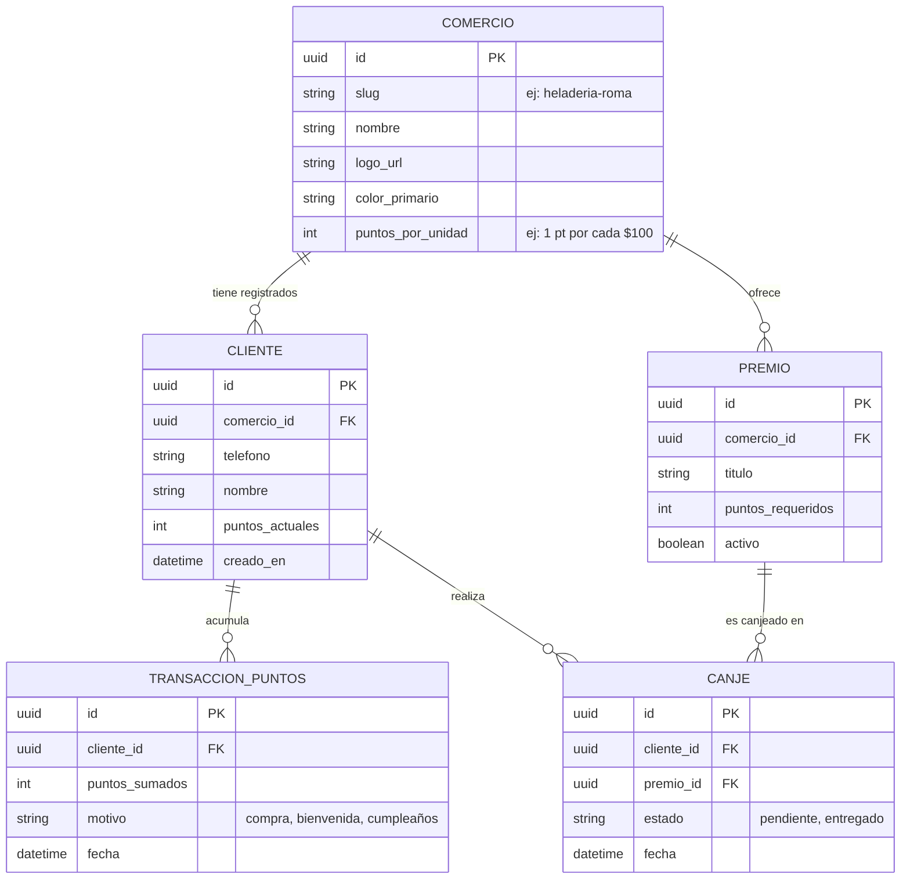
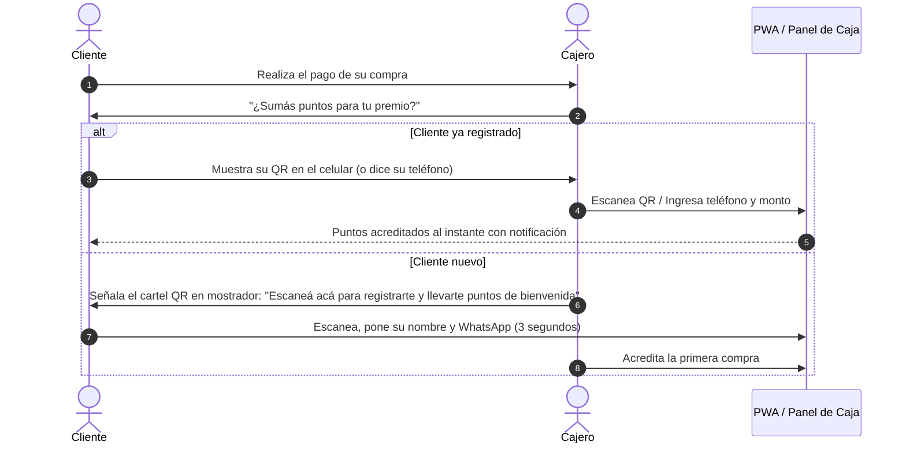
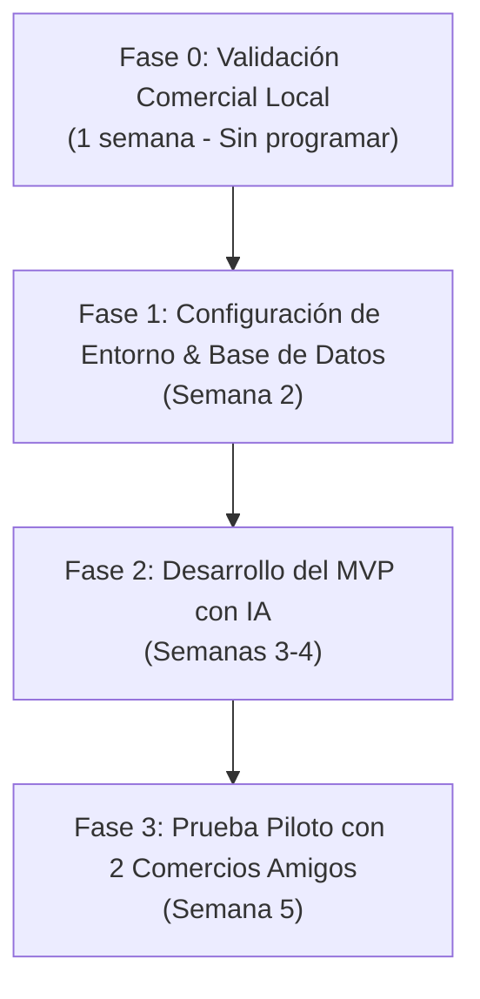

# Columna Vertebral y Estudio de Factibilidad: Sistema de Fidelización Local

> **Objetivo:** Diseñar la arquitectura conceptual, técnica y comercial para lanzar una plataforma de fidelización de clientes por puntos y recompensas adaptada a comercios locales, evaluando su viabilidad antes del desarrollo.

---

## 1. Veredicto de Factibilidad

* **Técnica:** **100% viable.** Con formación técnica en Informática y el apoyo de IA para escribir código, no necesitas programar un backend complejo desde cero. Usando un *Backend-as-a-Service* (BaaS) como **Supabase** y un frontend moderno con **Next.js**, la complejidad se reduce drásticamente.
* **Económica:** **Excelente.** La infraestructura inicial opera dentro de los planes gratuitos de plataformas líderes (Vercel, Supabase, Cloudflare). No hay costos fijos pesados antes de tener clientes que paguen.
* **Comercial:** **Muy alta.** Los comerciantes locales rechazan plataformas grandes porque nadie les explica cómo usarlas o no tienen soporte. Que tú y tu padre vayan en persona al local con los QR listos para imprimir es el factor diferenciador clave.

---

## 2. Los 3 Pilares del Sistema (Arquitectura)

Para que el negocio funcione, el software se divide en tres componentes interconectados sobre una única base de datos:

### A. La PWA del Cliente (Sin Tienda de Apps)
* **¿Qué es?** Una aplicación web progresiva (PWA). Cuando el cliente escanea el QR en el local, abre una URL tipo `club.tumarca.com/panaderia-san-jose`.
* **Experiencia de usuario:**
  * No ocupa memoria ni pide descargar nada de Google Play o App Store.
  * Con un clic se puede "Añadir a la pantalla de inicio", quedando con el icono y nombre del comercio.
  * Muestra: Saldo de puntos acumulados, catálogo de premios alcanzables, historial de visitas y ruleta de premios.
  * Registro rápido: Solo teléfono y nombre (sin contraseñas complejas que demoren la fila).

### B. El Panel del Comercio (Modo Mostrador & Gerencial)
* **Modo Mostrador (Cajero / Empleado):**
  * Diseñado para operar en **menos de 5 segundos**.
  * Opción 1: Escanear con la cámara del celular/tablet de la tienda el QR del cliente.
  * Opción 2: Buscar al cliente por su número de celular o DNI.
  * Botón rápido: Ingresar monto de compra o presionar "+X Puntos".
* **Modo Dueño:**
  * Crear y editar premios (ej. *"100 pts = Café gratis"*, *"300 pts = 20% descuento"*).
  * Ver métricas simples: cuántos clientes vinieron hoy, clientes inactivos hace 30 días, premios más canjeados.
  * Exportar lista de clientes a Excel.

### C. La Landing Page de tu Negocio Local
* Tu vitrina de ventas orientada a dueños de negocios de tu ciudad.
* Explica la propuesta: *"Aumentá la recurrencia de tus clientes con tu propia app de puntos en 72 horas"*.
* Botón directo a WhatsApp para agendar una demostración en el propio local del comerciante.

---

## 3. Stack Tecnológico Recomendado (Optimizado para Programar con IA)

Para que sea fácil de mantener y desarrollar con agentes de IA, evitamos stacks complicados con microservicios o servidores propios:

| Capa | Tecnología | ¿Por qué esta elección? |
| :--- | :--- | :--- |
| **Frontend & PWA** | **Next.js (React) + Tailwind CSS** | Estándar de la industria, interfaz rápida, soporte nativo de PWA y el código que mejor genera la IA sin errores. |
| **Backend & Base de Datos** | **Supabase (PostgreSQL)** | Incluye base de datos, autenticación de usuarios, seguridad a nivel de filas (RLS) y APIs en tiempo real ya listas. Te ahorra el 80% del trabajo de backend. |
| **Hosting & Despliegue** | **Vercel** | Despliegue con un clic desde GitHub. Incluye certificado SSL gratis y velocidad global. |
| **Imágenes & Logos** | **Supabase Storage** | Almacena los logos y fotos de premios de cada comercio. |

---

## 4. Modelo de Datos Central (La Columna Vertebral)

La base de datos es **multi-tenant** (un solo sistema maneja todos los comercios de tu ciudad de forma aislada y segura):

---

## 5. El Flujo de Caja (El punto crítico del negocio)

> [!IMPORTANT]
> Si la carga de puntos demora más de 10 segundos en la caja de un negocio concurrido, los cajeros dejarán de usar el sistema. La velocidad operativa lo es todo.

---

## 6. Estructura de Costos de Infraestructura

Para evaluar la viabilidad financiera con tu padre:

| Servicio | Nivel Inicial (Fase Piloto / 1 a 10 comercios) | Nivel Escala (10 a 50 comercios) |
| :--- | :--- | :--- |
| **Vercel** (Hosting) | **$0 USD / mes** (Plan Hobby gratuito) | **$20 USD / mes** (Plan Pro) |
| **Supabase** (Base de datos y Auth) | **$0 USD / mes** (Plan gratuito: hasta 500 MB BD y 50.000 usuarios) | **$25 USD / mes** |
| **Dominio Web** (.com o local) | **~$10 a $15 USD / año** | ~$10 a $15 USD / año |
| **Cartelería inicial (Acrílicos + QR)** | ~$3 a $5 USD por comercio (físico local) | Se cobra al comercio en el setup |
| **Total Costo Mensual Tecnológico** | **$0 USD/mes** | **~$45 USD/mes** |

*Margen:* Si cobras una mensualidad razonable a cada comercio (por ejemplo, el equivalente a $20–$40 USD/mes), con **2 a 3 comercios ya cubres el 100% de los costos operativos** y el resto es ganancia neta recurrente.

---

## 7. Plan de Acción en Fases

1. **Fase 0 (Comercial - Hoy):** Hablar con 2 o 3 dueños de negocios conocidos (amigos, cafetería de confianza, etc.) y preguntarles: *"Si te armo una app con tu logo para que tus clientes vuelvan más seguido, ¿la probarías gratis el primer mes?"*
2. **Fase 1 (Cimientos técnicos):** Inicializar el repositorio en Next.js, vincularlo a Supabase y crear las tablas de datos.
3. **Fase 2 (Desarrollo núcleo):**
   * Pantalla de cliente (ver puntos y premios).
   * Pantalla de cajero (sumar puntos en 1 clic).
4. **Fase 3 (Lanzamiento piloto):** Imprimir los primeros carteles para mostrador y ponerlo a prueba en vivo.
