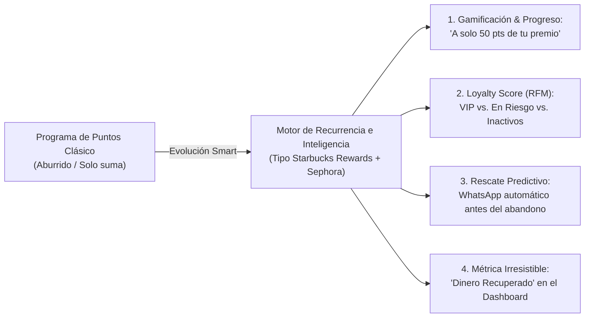
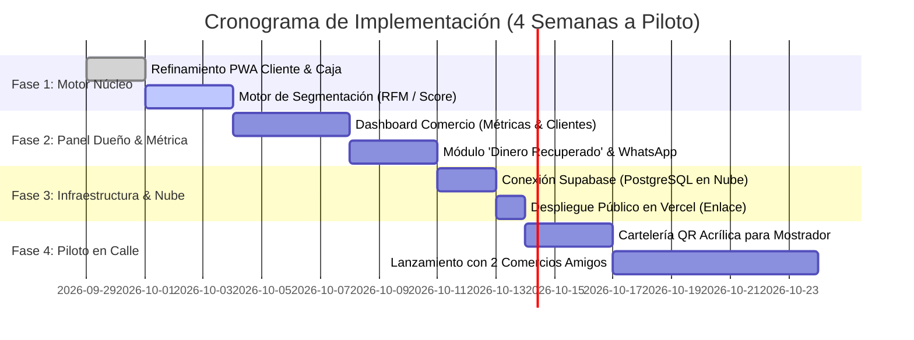

# 🗺️ Plan Maestro de Desarrollo y Negocio: Plataforma de Fidelización Local
> **Proyecto:** Smart Loyalty Engine (Inspirado en SilverSeaCode + Visión Estratégica Rivas)  
> **Objetivo:** Transformar un programa de puntos tradicional en un **sistema inteligente de retención y recurrencia para comercios locales**, validado con comercios reales y con coste tecnológico inicial de $0/mes.

---

## 🧭 Visión Estratégica: El Salto Cualitativo

---

## 📅 Hoja de Ruta en 4 Fases Clave

---

## 🛠️ Desglose Detallado de Cada Fase

### FASE 1: El Motor Inteligente de Fidelización (Semana 1)
*Objetivo: Convertir la app en un sistema que "piense" el comportamiento de cada cliente.*

1. **Psicología de Progreso en la PWA del Cliente:**
   * Mostrar de forma destacada: *"Te faltan solo X puntos para tu próximo premio"* (heurística de Starbucks).
   * Refuerzo de **Rachas de compra** (compras semanales que multiplican puntos).
   * Ruleta de premios diaria con sonido y confeti para incentivar que el cliente abra la app con frecuencia.
2. **Algoritmo de Loyalty Score (0–100):**
   * Clasificación automática de clientes según su **RFM**:
     * **Recencia:** Días desde la última compra.
     * **Frecuencia:** Cada cuántos días suele comprar.
     * **Monto:** Ticket acumulado.
   * Asignación de estados dinámicos:
     * 🟢 **VIP / Fiel:** Viene con frecuencia y gasta alto.
     * 🔵 **En Crecimiento:** Cliente nuevo que ha repetido 2-3 veces.
     * 🟡 **En Riesgo:** Excedió su ciclo habitual de visita (ej. suele venir cada 15 días y van 22 días).
     * 🔴 **Inactivo:** Más de 45 días sin visitar el negocio.

---

### FASE 2: El Dashboard del Dueño del Comercio (Semana 2)
*Objetivo: Que el comerciante vea el valor de la plataforma en dinero real, no solo en visitas.*

1. **Panel Gerencial del Negocio (`/admin/[slug]`):**
   * Vista de salud del negocio:
     * Total de clientes en el club.
     * Clientes activos esta semana.
     * **Clientes en Riesgo de Abandono (El foco de rescate).**
2. **El Botón de "Rescate por WhatsApp":**
   * Para los clientes en estado 🟡 *En Riesgo*, el panel permite al dueño hacer 1 clic y abrir WhatsApp Web con mensaje personalizado:
     > *"¡Hola {Nombre}! Notamos que hace unos días no pasás por {Comercio}. Tenés {Puntos} acumulados y estás a un paso de tu premio. Te regalamos un beneficio si venís esta semana."*
3. **Métrica Clave: "Dinero Recuperado":**
   * Contador visual en el panel: *"Has recuperado \$XX.XXX en ventas este mes gracias a clientes rescatados"*.
   * Esta métrica es el argumento de venta para que el comerciante renueve su suscripción mensual con gusto.

---

### FASE 3: Despliegue en la Nube y Operación 100% Online (Semana 3)
*Objetivo: Sacar el sistema de tu computadora local y tenerlo en internet con coste cero.*

1. **Creación del Proyecto en Supabase (Base de Datos):**
   * Crear cuenta gratuita en [supabase.com](https://supabase.com).
   * Ejecutar el script `supabase-schema.sql` que ya preparamos en el SQL Editor (se crean las tablas en 10 segundos).
   * Conectar las credenciales en `.env.local`.
2. **Subida a GitHub y Despliegue en Vercel:**
   * Repositorio remoto en GitHub.
   * Conexión a Vercel con 1 clic:
     * Dominio web público instantáneo (ej: `https://fidelizartuciudad.vercel.app`).
     * Certificado SSL de seguridad (HTTPS) automático.
     * Accesible desde cualquier celular en cualquier parte del mundo.

---

### FASE 4: Validación Comercial Presencial (Semana 4)
*Objetivo: Cerrar los 2 primeros comercios piloto y obtener pruebas reales.*

1. **Kit de Puesta en Marcha:**
   * 2 soportes acrílicos tamaño A5 para el mostrador (coste: ~$3 USD c/u en librería/gráfica local).
   * Diseño del cartel impreso con el logo del comercio y el código QR grande: *"Escaneá acá, sumá puntos y ganá premios con tu compra"*.
2. **Selección de los Comercios Piloto:**
   * Buscar 2 negocios donde tengan confianza (amigos, familiares o clientes habituales):
     * Ideal 1: Una cafetería o panadería (alta frecuencia de compra diaria/semanal).
     * Ideal 2: Una barbería o hamburguesería (ticket medio recurrente).
   * La oferta: *"Te instalamos el sistema gratis durante 30 días, te regalamos el cartel con tu logo y capacitamos a tus chicos en 10 minutos. A cambio, medimos cuántos clientes vuelven"*.
3. **Cierre de Testimonios y Escalado:**
   * Con fotos reales de los carteles en el mostrador y el testimonio en video del dueño: *"En 30 días sumamos 120 clientes y recuperamos clientes que no venían hace semanas"*.
   * Con ese material, salir a visitar el resto de negocios de la ciudad con un catálogo y presentación en mano.
