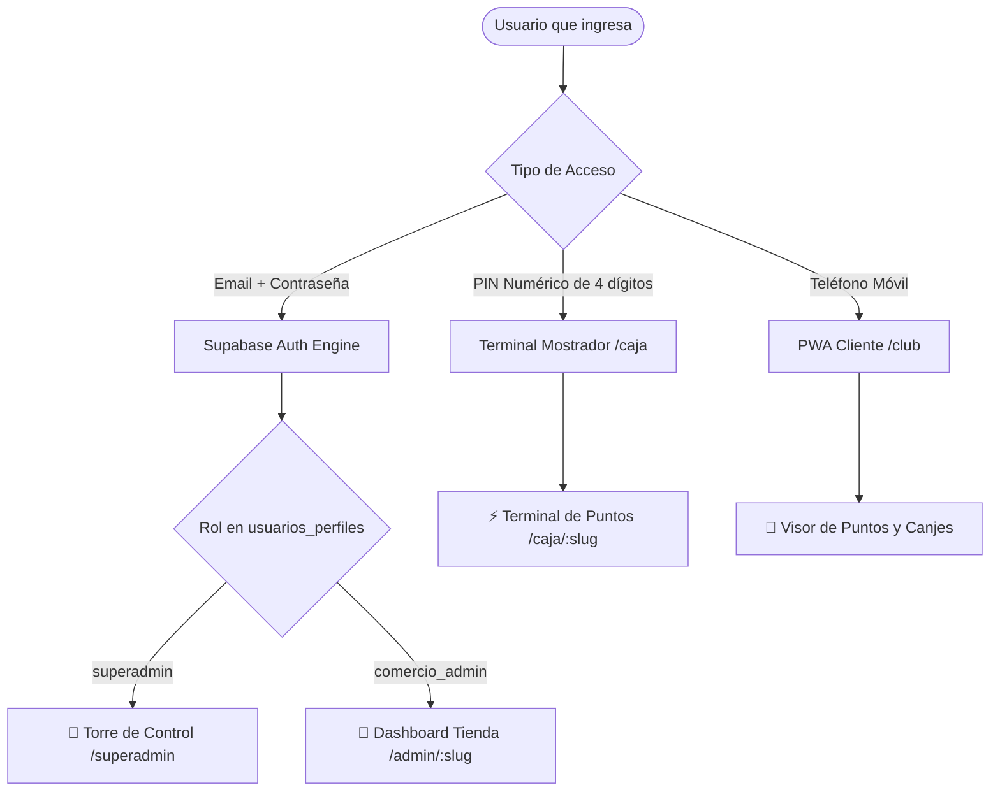

# 🛡️ Especificación Técnica de Arquitectura: Sistema de Autenticación Multi-Tenant y RBAC (FidelizaLocal)

> **Fecha:** 2026-09-29  
> **Estado:** Aprobado para Planificación  
> **Autor:** Antigravity & Carlo  
> **Área:** Seguridad, Autenticación y Multi-Tenancy  

---

## 1. Visión y Objetivos

El objetivo de este sistema es dotar a la plataforma **FidelizaLocal** de una arquitectura robusta, escalable y difícil de vulnerar, que permita a cada comercio registrado operar en su propia "ventana de trabajo" (dashboard aislado), brindar al personal de mostrador un acceso ágil por PIN, ofrecer a los clientes finales una consulta sin fricción de sus puntos y compras, y otorgar al dueño de la plataforma una **Torre de Control (SuperAdmin)** para supervisar todas las tiendas y el negocio recurrente (MRR).

### Criterios de Éxito
1. **Aislamiento Multi-Inquilino Absoluto:** Ningún comercio puede leer, modificar ni inferir información de otro comercio, garantizado tanto a nivel de rutas (`middleware.ts`) como a nivel de base de datos (`PostgreSQL Row-Level Security`).
2. **Mitigación de Amenazas Comunes:** Resistencia a ataques de fuerza bruta (rate limiting), inyección SQL (parametrización nativa en Postgres), robo de sesión (cookies `HttpOnly`, `SameSite=Lax`, `Secure`) y salto de privilegios (IDOR / BOLA).
3. **Experiencia de Usuario Adaptada:**
   - **SuperAdmin:** Login con email y contraseña maestra. Vista consolidada de toda la red.
   - **Dueño de Comercio:** Registro en 2 minutos (autoservicio o asistido), prueba gratuita de 14 días y panel analítico completo.
   - **Cajero / Personal:** Desbloqueo rápido por teclado numérico con PIN de 4 dígitos, sin acceso a métricas financieras.
   - **Consumidor Final:** Identificación instantánea por número de teléfono en `/club/[slug]`.

---

## 2. Jerarquía de Roles y Matriz de Permisos (RBAC)



### Matriz de Acceso a Rutas y Recursos

| Rol | Método de Identificación | Rutas Permitidas | Acceso a Datos de Clientes | Configuración de Tienda | Métricas Financieras / Dinero Recuperado |
| :--- | :--- | :--- | :--- | :--- | :--- |
| **`superadmin`** | Email + Contraseña (MFA opcional) | `/superadmin/**`, `/admin/**`, `/caja/**` | Global (todas las tiendas) | Global | Global (MRR, Churn, Actividad) |
| **`comercio_admin`** | Email + Contraseña | `/admin/[slug]/**`, `/caja/[slug]` | Exclusivo de su tienda | Su tienda | Su tienda |
| **`cajero`** | PIN de 4 dígitos | `/caja/[slug]` | Solo consulta de saldo y suma de puntos por teléfono | Ninguna | Bloqueado |
| **`cliente`** | Número de WhatsApp / Teléfono | `/club/[slug]` | Solo su propio historial | Ninguna | Bloqueado |

---

## 3. Modelo de Datos y Seguridad en Base de Datos (PostgreSQL / Supabase)

### 3.1. Tabla de Perfiles de Usuario (`usuarios_perfiles`)
Enlaza las identidades criptográficas de `auth.users` con el modelo multi-tenant:

```sql
CREATE TABLE IF NOT EXISTS public.usuarios_perfiles (
    id UUID PRIMARY KEY REFERENCES auth.users(id) ON DELETE CASCADE,
    email TEXT NOT NULL,
    nombre TEXT NOT NULL,
    rol TEXT NOT NULL CHECK (rol IN ('superadmin', 'comercio_admin')),
    comercio_id UUID REFERENCES public.comercios(id) ON DELETE SET NULL,
    created_at TIMESTAMPTZ DEFAULT NOW(),
    updated_at TIMESTAMPTZ DEFAULT NOW()
);

-- Índice para búsquedas ultrarrápidas de sesión
CREATE INDEX IF NOT EXISTS idx_usuarios_perfiles_rol_comercio 
ON public.usuarios_perfiles (rol, comercio_id);
```

### 3.2. Modificaciones a la Tabla `comercios`
```sql
ALTER TABLE public.comercios 
ADD COLUMN IF NOT EXISTS pin_hash TEXT DEFAULT NULL,
ADD COLUMN IF NOT EXISTS estado_cuenta TEXT DEFAULT 'trial' CHECK (estado_cuenta IN ('trial', 'activo', 'suspendido', 'vencido')),
ADD COLUMN IF NOT EXISTS trial_expira_at TIMESTAMPTZ DEFAULT (NOW() + INTERVAL '14 days'),
ADD COLUMN IF NOT EXISTS plan TEXT DEFAULT 'starter' CHECK (plan IN ('starter', 'pro', 'enterprise'));
```

### 3.3. Políticas RLS (Row-Level Security)
Cada consulta ejecutada por el cliente web es filtrada por el motor de PostgreSQL:

```sql
-- 1. Habilitar RLS estricto en tablas operativas
ALTER TABLE public.comercios ENABLE ROW LEVEL SECURITY;
ALTER TABLE public.clientes ENABLE ROW LEVEL SECURITY;
ALTER TABLE public.premios ENABLE ROW LEVEL SECURITY;
ALTER TABLE public.transacciones_puntos ENABLE ROW LEVEL SECURITY;
ALTER TABLE public.canjes ENABLE ROW LEVEL SECURITY;

-- 2. Función helper para obtener el rol y comercio_id del token actual
CREATE OR REPLACE FUNCTION public.get_current_user_profile()
RETURNS TABLE (rol TEXT, comercio_id UUID) 
LANGUAGE sql STABLE SECURITY DEFINER AS $$
    SELECT rol, comercio_id 
    FROM public.usuarios_perfiles 
    WHERE id = auth.uid();
$$;

-- 3. Política de Comercios: SuperAdmin ve todo, Dueño ve solo el suyo
CREATE POLICY "Acceso a comercios por rol" ON public.comercios
FOR ALL TO authenticated
USING (
    EXISTS (
        SELECT 1 FROM public.usuarios_perfiles up
        WHERE up.id = auth.uid() 
        AND (up.rol = 'superadmin' OR up.comercio_id = comercios.id)
    )
);

-- 4. Política de Clientes: Aislamiento por comercio_id
CREATE POLICY "Aislamiento de clientes por comercio" ON public.clientes
FOR ALL TO authenticated
USING (
    EXISTS (
        SELECT 1 FROM public.usuarios_perfiles up
        WHERE up.id = auth.uid() 
        AND (up.rol = 'superadmin' OR up.comercio_id = clientes.comercio_id)
    )
)
WITH CHECK (
    EXISTS (
        SELECT 1 FROM public.usuarios_perfiles up
        WHERE up.id = auth.uid() 
        AND (up.rol = 'superadmin' OR up.comercio_id = clientes.comercio_id)
    )
);
```

---

## 4. Flujo de Autenticación y Protección de Rutas (Next.js)

### 4.1. Edge Middleware (`src/middleware.ts`)
El middleware intercepta toda solicitud entrante antes de que el servidor o cliente renderice código:

1. **Lectura de Cookie de Sesión:** Mediante `@supabase/ssr`, se obtiene la sesión activa.
2. **Evaluación de Rutas:**
   - `/superadmin/**`: Requiere sesión activa con `rol === 'superadmin'`. Si no cumple, redirige a `/login?redirect=/superadmin`.
   - `/admin/[slug]/**`: Requiere sesión activa. Se valida que el `comercio_id` del usuario corresponda al `slug` solicitado en la URL, a menos que el usuario sea `superadmin`. Si intenta acceder a otra tienda, retorna HTTP 403 con pantalla de acceso restringido.
   - `/caja/[slug]`: Si no hay sesión de dueño, se valida la presencia de una cookie de sesión de caja firmada (`caja_session_[slug]`) generada tras ingresar el PIN correcto.
   - `/login` y `/registro`: Si ya existe sesión, redirige automáticamente al panel correspondiente.

---

## 5. Diseño de Interfaces de Usuario

### 5.1. Pantalla de Acceso Unificada (`/login`)
- **Estilo Visual:** Hallmark boutique oscuro con acentos ámbar (#f59e0b) y pizarra (#1e293b).
- **Pestaña 1 (Dueño / Admin):** Email + Password con botón para ver/ocultar contraseña, enlace a recuperación de contraseña y enlace a registro de prueba de 14 días.
- **Pestaña 2 (Caja / Mostrador):** Selector de comercio y teclado numérico en pantalla (óptimo para tablets y pantallas táctiles de mostrador).
- **Indicador de Seguridad:** Notificación de conexión cifrada y limitador de intentos.

### 5.2. Pantalla de Registro / Onboarding (`/registro`)
- Asistente de 3 pasos:
  1. **Datos de la Cuenta:** Nombre del dueño, email, contraseña robusta.
  2. **Datos del Comercio:** Nombre comercial, rubro (hamburguesería, cafetería, etc.), logo/emoji, color de marca.
  3. **Configuración Inicial:** Premio inicial (ej. "Café gratis a los 100 pts") y creación del PIN de caja inicial (ej. `1234`).
- Al completar, se aprovisiona el registro en `comercios` con `estado_cuenta = 'trial'` y `trial_expira_at = NOW() + 14 días`, iniciando sesión de inmediato en `/admin/[slug]`.

### 5.3. Torre de Control SuperAdmin (`/superadmin`)
- Indicadores superiores: MRR proyectado, comercios activos, comercios en prueba, clientes totales fidelizados.
- Tabla con filtro de búsqueda rápida y badges de estado (`Trial`, `Activo`, `Vencido`).
- Botón *"Ver como..."* (Impersonation seguro): Permite al SuperAdmin auditar el panel de cualquier comercio con un solo clic.

---

## 6. Auditoría de Seguridad y Resiliencia

1. **Protección Anti-Fuerza Bruta:** Rate-limiting en el endpoint de autenticación (máximo 5 intentos por IP/cuenta en 15 minutos).
2. **Hasheo Seguro de PINs:** El PIN de caja nunca se almacena en texto plano; se utiliza `bcrypt` o `argon2` para su cotejo.
3. **Tokens Criptográficos en Cookies:** Supabase maneja la rotación automática de refresh tokens con cookies HttpOnly, mitigando riesgos de fugas en `localStorage`.
4. **Prevención de Ataques IDOR (Insecure Direct Object Reference):** Ningún parámetro de URL (`[slug]` o `comercio_id`) es confiado a ciegas sin cotejo contra la sesión autenticada.

---

## 7. Plan de Verificación y Pruebas

1. **Test 1: Login de SuperAdmin:** Verificar que ingresa a `/superadmin` y puede visualizar todas las tiendas.
2. **Test 2: Aislamiento de Comercio:** Con la sesión de "Fabbrica Burger", intentar navegar manualmente a `/admin/pizzeria-roma`. Confirmar que el middleware bloquea el acceso con un 403 claro.
3. **Test 3: Terminal de Caja con PIN:** Verificar que `/caja/fabbrica-burger` solicita el PIN numérico, y que al ingresar `1234` desbloquea la interfaz de suma de puntos sin exponer datos financieros.
4. **Test 4: Registro Autoservicio (Trial 14 días):** Crear una tienda de prueba desde `/registro` y verificar que sus datos se crean con la fecha de expiración correcta y acceso directo a su panel.
